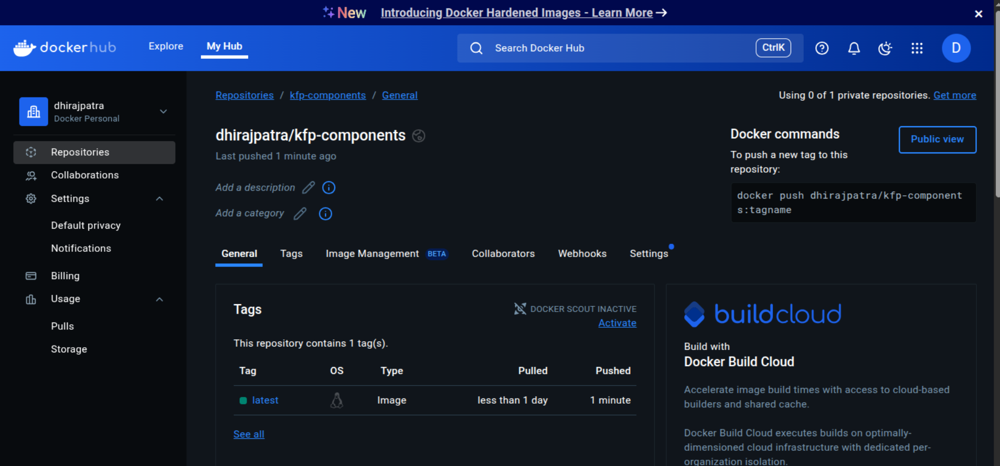

# 🚀 Kubeflow Pipelines: Iris Classifier (End-to-End Example)

This project demonstrates how to build an end-to-end ML pipeline using **Kubeflow Pipelines (KFP v2)** with Dockerized components.


---

## 📁 Project Structure

```

kubeflow-demo/
├── components/
│   ├── preprocess.py        # Preprocessing step
│   ├── train.py             # Training step
│   └── requirements.txt     # Requirements for Docker container
├── Dockerfile               # Shared Dockerfile for all components
├── pipeline.py              # KFP pipeline definition
├── compile.py               # Compiles the pipeline to YAML
├── upload\_pipeline.py       # Uploads pipeline to KFP
└── README.md

````

---

## ⚙️ Prerequisites

- Docker installed and configured
- Python 3.8+
- Docker Hub account (for pushing component image)
- `pip install kfp==2.13.0`

---

## 🐳 Build and Push Docker Image for Pipeline Components [use your dockerhub username]

```bash
cd components
docker build -t dhirajpatra/kfp-components:latest .
docker push dhirajpatra/kfp-components:latest
````

> Replace `dhirajpatra` with your actual Docker Hub username.
> Ensure you're logged in: `docker login`

---

## 🧱 Compile and Upload the Pipeline

```bash
# Step 1: Compile to YAML
python compile.py

# Step 2: Upload to KFP dashboard
python upload_pipeline.py
```

> These scripts use the KFP Python SDK to define and upload the pipeline.

---

## 🧪 Run KFP Standalone Dashboard (Locally via Docker)

### 1️⃣ Clone and Start Standalone KFP

```bash
git clone https://github.com/kubeflow/pipelines.git
cd pipelines/standalone
docker compose -f docker-compose.yaml up
```

> This starts the minimal KFP stack locally via Docker Compose.

### 2️⃣ Open Dashboard

Visit:

```
http://localhost:3000
```

### 3️⃣ Upload and Run Your Pipeline

* Go to `http://localhost:3000`
* Click **Upload pipeline**
* Select `kfp_pipeline.yaml`
* Click **Start** to run

---

## 🧰 Requirements

### 📦 components/requirements.txt

```text
scikit-learn
pandas
mlflow
joblib
```

### 📦 Main requirements (for Python SDK)

```text
kfp==2.13.0
```

---

## 📝 References

* [https://www.kubeflow.org/docs/components/pipelines/](https://www.kubeflow.org/docs/components/pipelines/)
* [https://github.com/kubeflow/pipelines](https://github.com/kubeflow/pipelines)
* [https://github.com/kubeflow/pipelines/tree/master/standalone](https://github.com/kubeflow/pipelines/tree/master/standalone)

---

## 👨‍💻 Author

**Dhiraj Patra** — [@dhirajpatra](https://github.com/dhirajpatra)